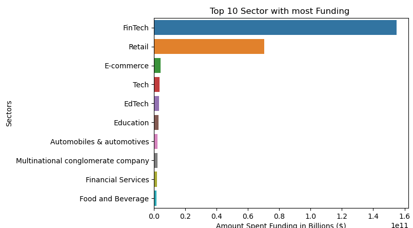
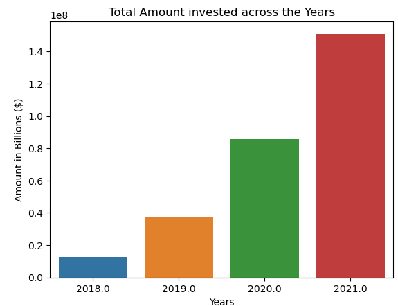

# Descriptive-Analysis-of-the-Indian-Start-up-Funding

## Description

In this project I explore and analyze the funding received by Indian start-ups from 2018-2021,to give insight to my team that is looking to venture in the Indian start-up business. I used python in my Analysis. 

## Column names in the dataset used
Company/Brand - The name of the start-up\
Founded -The year the star-up began\
What it does -The description of what the company does.\
Founders - The founders of the company\
Investors - The stakeholders in the company\
Amount - The funding received in ($)\
Stage - The stages of the funding provided\
Sector - The sections that the company belong to.


## Hypothesis
Null Hypothesis: There is no relationship  between the sector and the stages of funding available.\

Other questions are raised to help answer the hypothesis.

## Usage
```python
import pandas as pd
import numpy as np
from glob import glob
import seaborn as sns
from matplotlib import pyplot as plt
```
## Screenshots
1.What are the growing sectors in the Indian Startup Eco-system in terms of the funding received.


2. How much funding do the top stages provide.


3. How much funding is distributed across the years.



## Contributions
Pull requests are welcomed

## Author
Penina Pendo.


