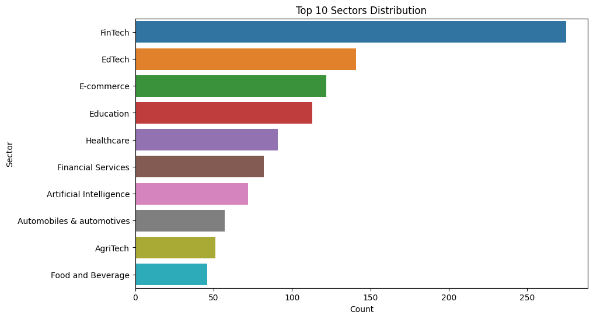
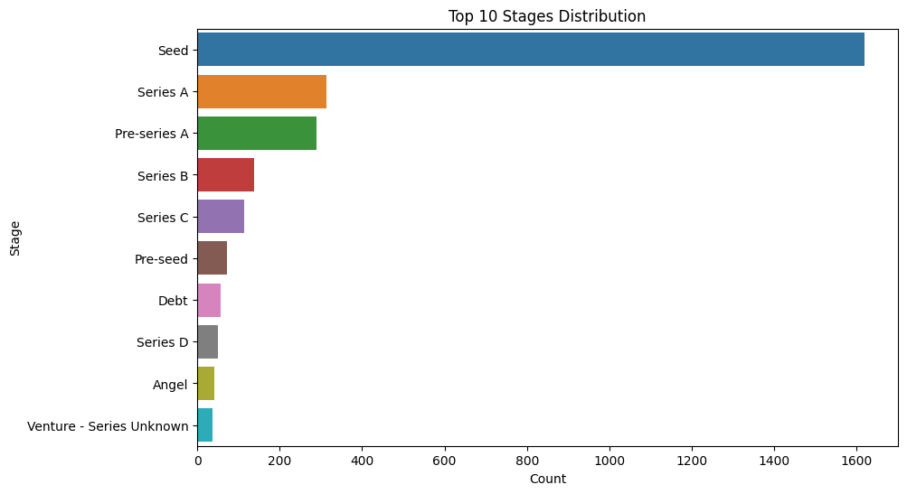
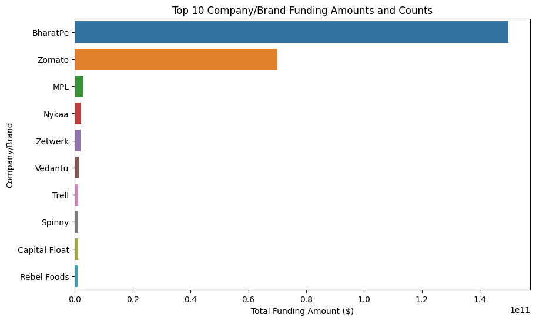
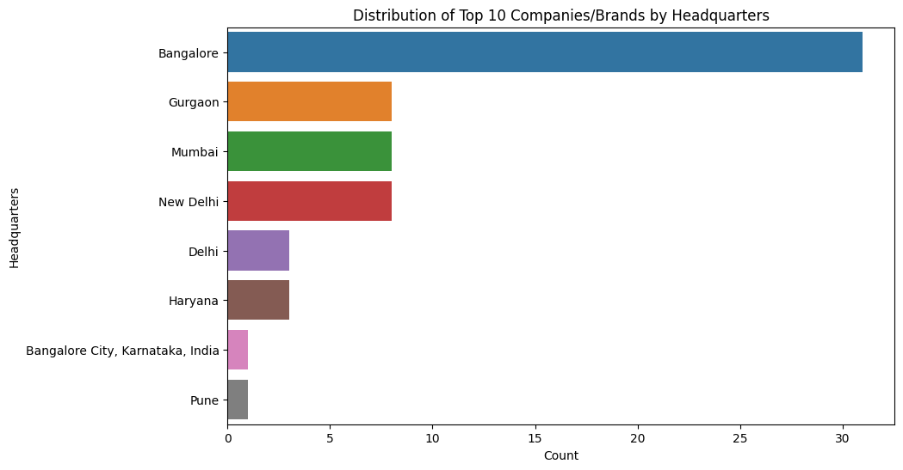
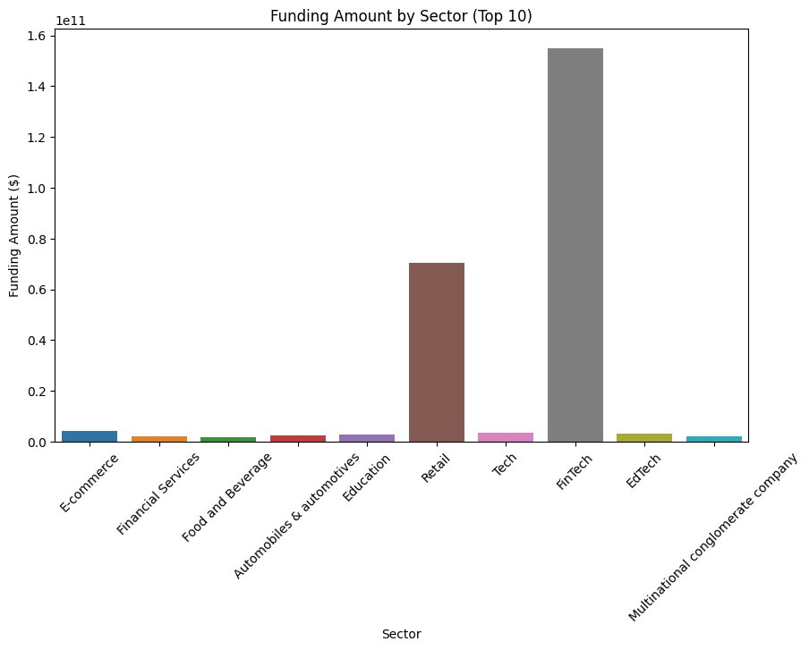

# 🚀Descriptive-Analysis-of-the-Indian-Start-up-Funding📊

This repository contains a descriptive analysis of the Indian startup ecosystem, aiming to uncover insights and trends within the vibrant landscape. 🇮🇳💼

## Table of Contents
[Introduction](Introduction)\
[Data](Data)\
[Research Questions](Research_Questions)\
[Methodology](Methodology)\
[Findings](Findings)\
[Conclusion](Conclusion)\
[Contributing](Contribution)

## Introduction

📚 Welcome to our descriptive analysis project focusing on the Indian startup ecosystem! This research aims to gain a deeper understanding of the factors influencing startup success in India. By analyzing funding amounts, headquarters' locations, and other relevant features, we hope to provide valuable insights for entrepreneurs, investors, and enthusiasts.

## Data
📊 Our analysis is based on a comprehensive dataset comprising information on Indian startups.  The data has been carefully collected from several years duration

This dataset includes funding details as follows:

**Company/Brand**- The name of the start-up\
**Founded** -The year the star-up began\
**What it does** -The description of what the company does.\
**Founders** - The founders of the company\
**Investors** - The stakeholders in the company\
**Amount** - The funding received in ($)\
**Stage** - The stages of the funding provided\
**Sector** - The sections that the company belong to.

## Research Questions
🔍 We sought to explore several research questions to shed light on the Indian startup ecosystem, including:

## RESEARCH QUESTIONS

1.What is the funding amount ($) associated with the top 10 company/brand?\
2.What is the range of funding amounts for the top 10 companies/brands in the dataset?\
3.What is the distribution of top 10 companies/brands based on their headquarters' locations?\
4.Are there any notable patterns or trends in the funding activities based on the available features?

## Methodology
🔬 Our analysis followed a descriptive approach, utilizing various statistical techniques and visualizations to examine the dataset. We employed Python and popular libraries such as Pandas, Matplotlib, and Seaborn for data manipulation, analysis, and visualization.

Findings
📈 Our analysis uncovered intriguing insights into the Indian startup ecosystem:

🚀 Indian Startup Ecosystem Descriptive Analysis 📊

This repository contains a descriptive analysis of the Indian startup ecosystem, aiming to uncover insights and trends within the vibrant landscape. 🇮🇳💼

Table of Contents
Introduction
Data
Research Questions
Methodology
Findings
Conclusion
Contributing
License
Introduction
📚 Welcome to our descriptive analysis project focusing on the Indian startup ecosystem! This research aims to gain a deeper understanding of the factors influencing startup success in India. By analyzing funding amounts, headquarters' locations, and other relevant features, we hope to provide valuable insights for entrepreneurs, investors, and enthusiasts.

Data
📊 Our analysis is based on a comprehensive dataset comprising information on Indian startups. This dataset includes funding details, industry sectors, and more. The data has been carefully collected from reliable sources and cleaned for analysis.

Research Questions
🔍 We sought to explore several research questions to shed light on the Indian startup ecosystem, including:

What is the funding amount ($) associated with the top 10 companies/brands?
What is the range of funding amounts for the top 10 companies/brands in the dataset?
What is the distribution of top 10 companies/brands based on their headquarters' locations?
Are there any notable patterns or trends in the funding activities based on the available features?
Methodology
🔬 Our analysis followed a descriptive approach, utilizing various statistical techniques and visualizations to examine the dataset. We employed Python and popular libraries such as Pandas, Matplotlib, and Seaborn for data manipulation, analysis, and visualization.

Findings
📈 Our analysis uncovered intriguing insights into the Indian startup ecosystem:

The top 10 companies/brands secured funding amounts ranging from X to Y dollars, indicating substantial investment opportunities.
Headquarters' locations of the top 10 companies/brands were concentrated in cities such as A, B, and C, suggesting the presence of thriving startup hubs.
Notable patterns emerged, highlighting the e-commerce, fintech, and edtech sectors as having higher growth potential in the Indian market.

## Conclusion
🔑 This descriptive analysis of the Indian startup ecosystem provides valuable insights for stakeholders seeking to understand the landscape. The findings indicate that startups in sectors such as e-commerce, fintech, and edtech hold promising growth opportunities. However, it's important to note that these conclusions are based on the analyzed dataset and further research is warranted to account for additional factors influencing startup success.

## Contributing
🤝 Contributions to this project are more than welcome! If you have any suggestions, enhancements, or additional analyses, please feel free to open an issue or submit a pull request. Let's collaborate and enhance our understanding of the Indian startup ecosystem together!

## Author
Penina Pendo.

